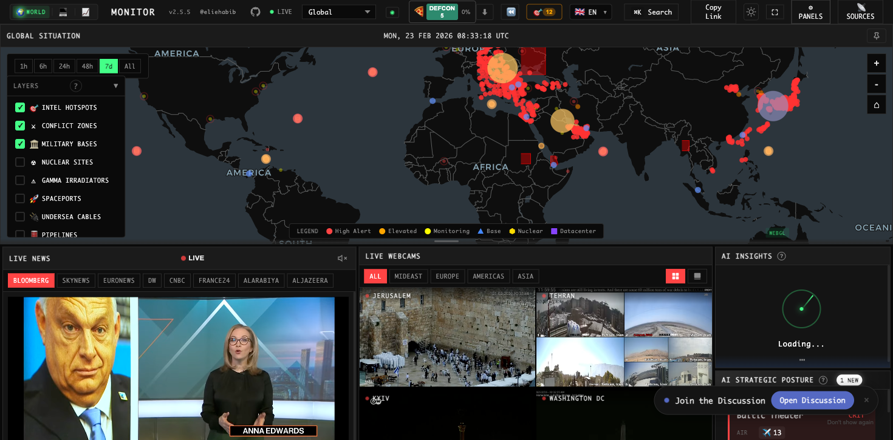

<p align="center">
  
</p>

<h1 align="center">🌐 RetailSaathi — World Monitor</h1>

<p align="center">
  
</p>

<p align="center">
  <a href="https://github.com/vickyvigneshcoc99-glitch/World-Monitor/stargazers"></a>
  <a href="https://github.com/vickyvigneshcoc99-glitch/World-Monitor/blob/main/LICENSE"></a>
  
  
  
</p>

<p align="center">
  <strong>A real-time global intelligence dashboard for situational awareness — open-source, AI-powered, and local-first.</strong><br/>
  Built with TypeScript · deck.gl · MapLibre GL · Tauri · Vite · ONNX Runtime Web
</p>

---

## 🧠 What Is This?

**World Monitor** (branded as **RetailSaathi** in this fork) is a high-performance OSINT dashboard that aggregates:

- **150+ RSS feeds** across geopolitics, defense, markets, energy, and tech
- **Live military tracking** — ADS-B flight data + AIS naval vessel positions
- **36+ interactive map layers** — conflicts, nuclear sites, undersea cables, pipelines, cyber threats, and more
- **AI-powered intelligence synthesis** — local LLMs (Ollama/LM Studio) with cloud fallback (Groq, OpenRouter)
- **Real-time market data** — crypto, equities, commodities, ETF flows, FRED economic data
- **Live webcam feeds** from 19 geopolitical hotspots across 4 regions

All in one dark-mode WebGL dashboard — no login required, no paywalls.

---

## ⚙️ Tech Stack

| Layer | Technology |
|---|---|
| **Frontend** | TypeScript, Vite, Vanilla DOM (no React/Vue) |
| **Map Rendering** | deck.gl (WebGL), MapLibre GL JS, D3.js (mobile fallback) |
| **Desktop App** | Tauri v2 (Rust + WebView) |
| **Backend/API** | Vercel Edge Functions, Node.js sidecar (Tauri) |
| **API Contracts** | Protocol Buffers (sebuf) — 20 typed services |
| **AI/ML** | Groq, OpenRouter, Ollama, LM Studio, ONNX Runtime Web (Transformers.js) |
| **Caching** | Upstash Redis (cross-user deduplication, 24h TTL) |
| **PWA** | Vite PWA plugin, Workbox, CacheFirst map tiles |
| **Languages** | TypeScript 81.7%, CSS 7.6%, JavaScript 7.7%, Rust 1.0% |

---

## 🗺️ Map Architecture

The globe uses a **hybrid dual-renderer** strategy:

```
Desktop (WebGL)                     Mobile (SVG)
──────────────────────────          ─────────────────────────
deck.gl ScatterplotLayer            D3.js + TopoJSON
deck.gl PathLayer (cables)          Simplified markers
deck.gl IconLayer (bases)           Touch-optimized popups
MapLibre GL base tiles              No WebGL required
GPU clustering (Supercluster)       Static GeoJSON render
60fps @ thousands of markers        Battery-efficient SVG
```

**Smart clustering** — Supercluster groups markers at low zoom; progressive disclosure reveals detail layers only when zoomed in. Label deconfliction suppresses overlapping BREAKING badges by severity priority.

---

## 🤖 AI Intelligence Pipeline

A **4-tier provider chain** ensures the UI is never blocked:

```
Request → Ollama/LM Studio (local, 0ms network)
         ↓ timeout/error
         → Groq (Llama 3.1 8B, ~500ms)
         ↓ timeout/error
         → OpenRouter (multi-model fallback)
         ↓ timeout/error
         → Browser T5 (Transformers.js ONNX, offline)
```

- Headlines are **Jaccard-deduplicated** before any LLM call (reduces prompt by 20–40%)
- Results are **Redis-cached** by composite key — 1,000 concurrent users trigger exactly **1** LLM call
- **Hybrid threat classification**: instant keyword classifier → async browser ML → batched LLM override

---

## 🛰️ Data Layers (36+)

<details>
<summary><strong>🔴 Geopolitical & Conflict</strong></summary>

- Active conflict zones (UCDP + ACLED dual-source)
- Intelligence hotspots with news correlation
- Social unrest events (Haversine-deduplicated ACLED + GDELT)
- Natural disasters (USGS M4.5+, GDACS, NASA EONET)
- Cyber threat IOCs — C2 servers, malware hosts, phishing (geo-located)
- Sanctions regimes, weather alerts
</details>

<details>
<summary><strong>🪖 Military & Strategic</strong></summary>

- 220+ military bases from 9 operators
- Live military flight tracking (ADS-B via OpenSky relay)
- Naval vessel monitoring (AIS via AISStream WebSocket)
- Nuclear facilities & gamma irradiators
- APT cyber threat actor attribution
- Spaceports & launch facilities
</details>

<details>
<summary><strong>🏗️ Infrastructure</strong></summary>

- 55+ undersea cables with landing points + NGA navigational warnings
- 88 oil & gas pipelines
- 111 AI datacenters (major compute clusters)
- 83 strategic ports (container, oil/LNG, naval, chokepoint)
- Cloudflare Radar internet outages
- NASA FIRMS satellite fire detection (VIIRS thermal)
- 19 global trade routes through strategic chokepoints
</details>

<details>
<summary><strong>📈 Finance</strong></summary>

- 92 global stock exchanges with market caps and trading hours
- 19 financial centers (GFCI-ranked)
- 13 central banks + BIS, IMF data
- Gulf FDI investments (64 Saudi/UAE projects plotted globally)
- WTO trade restrictions, tariff trends, bilateral flows
</details>

---

## 🏗️ System Architecture

```
┌─────────────────────────────────────────────────────────────────────┐
│                       Client (Browser / Tauri)                      │
│                                                                     │
│  deck.gl WebGL Map ─── Signal Aggregator ─── AI Insights Panel      │
│  D3.js SVG (mobile)    │   CII Scorer    │   Country Brief Page     │
│  Virtual List Renderer │   Focal Point   │   Trending Keywords      │
│                        │   Detector      │   Strategic Posture      │
└──────────────┬─────────┴────────┬────────┴──────────────────────────┘
               │                  │
               ▼                  ▼
┌─────────────────────┐  ┌────────────────────────────────────────────┐
│   Vercel Edge Fns   │  │          Railway Relay Server             │
│   (20 sebuf RPCs)   │  │  AIS WebSocket · OpenSky · RSS Proxy      │
│   Redis caching     │  │  Telegram OSINT · AIS Density Grid        │
│   CORS gating       │  │  Temporal Anomaly Baseline (Welford)      │
└─────────────────────┘  └────────────────────────────────────────────┘
               │                  │
               ▼                  ▼
┌──────────────────────────────────────────────────────────────────────┐
│              External APIs & Public Data Sources                     │
│  USGS · NASA EONET · ACLED · GDELT · Polymarket · Finnhub           │
│  CoinGecko · FRED · EIA · OpenSky · AISStream · Cloudflare Radar    │
│  NGA Navigational Warnings · WorldPop · Open-Meteo ERA5 · BIS       │
└──────────────────────────────────────────────────────────────────────┘
```

---

## 📡 API Design — Proto-First

All 20 service domains are defined in **Protocol Buffer (`.proto`) files** using sebuf HTTP annotations. Code generation produces:

1. `protoc-gen-ts-client` → typed fetch clients (`src/generated/client/`)
2. `protoc-gen-ts-server` → handler stubs + route descriptors
3. `protoc-gen-openapiv3` → OpenAPI 3.1.0 YAML/JSON docs

Every RPC is a `POST` endpoint at a static path (e.g., `POST /api/intelligence/v1/get-country-brief`) with CORS enforcement, rate-limit headers, and a top-level error boundary.

---

## 🚀 Country Instability Index (CII)

Real-time 0–100 composite risk score for every country with incoming data:

| Component | Weight | Method |
|---|---|---|
| **Baseline risk** | 40% | Per-country structural fragility profile |
| **Unrest events** | 20% | Log scale (democracies) / linear (authoritarian) |
| **Security activity** | 20% | Military flights (3pts) + vessels (5pts), foreign presence doubled |
| **Information velocity** | 20% | News frequency × severity multiplier, log-scaled |

23 curated Tier-1 nations have individually tuned profiles. All other countries with any signal use a universal default baseline (`DEFAULT_BASELINE_RISK = 15`).

---

## 🖥️ Local Development

```bash
# Clone
git clone https://github.com/vickyvigneshcoc99-glitch/World-Monitor.git
cd World-Monitor/worldmonitor-main

# Install dependencies
npm install

# Start dev server (Vite + API plugin)
npm run dev
# → http://localhost:3000

# Optional: start on a specific port
npx vite --port 5555 --strictPort --force

# Build for production
npm run build
```

> **Note:** Most data panels require API keys. Copy `.env.example` to `.env` and fill in the keys you need. All keys are optional — affected panels are silently disabled.

---

## 🔑 Key Environment Variables

| Variable | Service | Notes |
|---|---|---|
| `GROQ_API_KEY` | AI summaries (primary) | Free, 14,400 req/day |
| `FINNHUB_API_KEY` | Stock market data | Free registration |
| `ACLED_ACCESS_TOKEN` | Conflict & protest data | Free for researchers |
| `EIA_API_KEY` | Oil/energy analytics | Free |
| `NASA_FIRMS_API_KEY` | Satellite fire detection | Free |
| `AISSTREAM_API_KEY` | Live vessel tracking | Free |
| `UPSTASH_REDIS_REST_URL` | AI call deduplication | Free tier at upstash.com |

---

## 📁 Project Structure

```
worldmonitor-main/
├── src/
│   ├── App.ts                  # Main orchestrator
│   ├── components/             # UI panels (DeckGLMap, NewsPanel, etc.)
│   ├── services/               # Data fetching + business logic
│   ├── config/                 # Static data (feeds, geo, bases, cables)
│   ├── generated/              # Auto-generated proto clients/servers
│   ├── locales/                # 16 language JSON bundles
│   └── utils/                  # escapeHtml, sanitizeUrl, circuit-breaker
├── server/
│   └── worldmonitor/           # 20 sebuf handler implementations
├── api/
│   └── [domain]/v1/[rpc].ts    # Vercel Edge Function gateway
├── proto/                      # .proto service definitions (source of truth)
├── src-tauri/                  # Rust + Tauri desktop app
├── scripts/                    # Build, relay, AIS tools
└── docs/                       # Full documentation
```

---

## 🔒 Security

- **No hardcoded secrets** — all keys via `process.env.*`
- **Strict CORS allowlist** — production patterns only; dev localhost allowed separately
- **XSS prevention** — `escapeHtml()` and `sanitizeUrl()` applied to all external data
- **Analytics key stripping** — PostHog `sanitize_properties` redacts `sk-`, `gsk_`, `Bearer` prefixes
- **OS keychain** (desktop) — API keys stored in macOS Keychain / Windows Credential Manager, never plaintext
- **Content Security Policy** — strict CSP in `index.html`; blocks unauthorized scripts and connections

---

## 👤 Author

**Vicky Vignesh** — [GitHub @vickyvigneshcoc99-glitch](https://github.com/vickyvigneshcoc99-glitch)

---

## 📄 License

Licensed under the **AGPL-3.0** — free and open source.

---

<p align="center">
  <em>Built for situational awareness and open-source intelligence.</em><br/>
  <strong>⭐ Star this repo if you find it useful!</strong>
</p>
